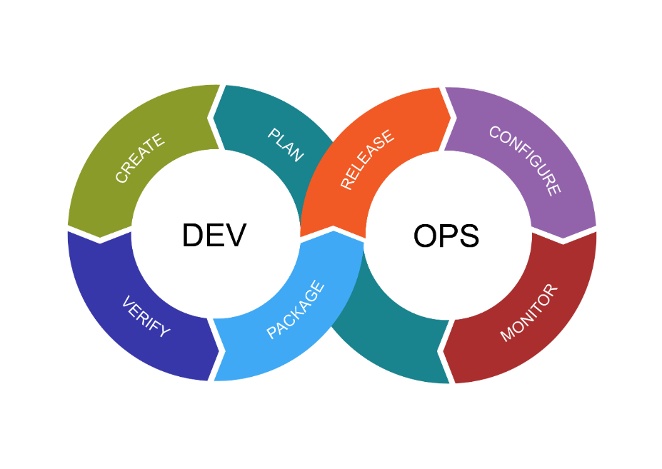

# Intro to DevOps

### What is DevOps?

DevOps is a philosophy of communication and collaboration and a way of working in the tech industry using short and continuous cycles of delivery.  

The above image shows the continuous cycle of creating, maintaining and releasing.

### Benefits of DevOps?  Benefits for Businesses?

The benefits of DevOps is that issues can be noticed sooner and communicated immediately which means that things can run more efficiently in a collaborative environment.  For businesses this means that time, money and effort can be saved and employees are happier and therefore able and willing to work better and faster.

### What does the role entail?

The role wil vary, depending on the company but DevOps engineers would be expected to have a general knowledge of everything within the whole CI/ CD (Continuous Integration/ Continuous Deliver/ Deployment) pipeline, as well as the soft skills necessary, such as communication.

### Who do DevOps engineers work with?

DevOps engineers work with other DevOps engineers, and multiple other engineers, a combination of specialists and generalists, including software engineers, QA engineers, security engineers, IT operations and software architects.

### What other teams does a DevOps engineer work with?

They may also have to work with Sales and Marketing so that everyone is on board with the same marketing goals.  They may need to work with legal to ensure that the continous deployments are compliant with legal regulations.

### What are their common deliverables? (What would they be expected to do on a daily basis?)

They may need to work on the automation backlog, meet the team to discuss continuous improvement, work on infrastructure, work on documentation and monitor and troubleshoot everything in the software lifecycle.

### What is the value of a DevOps engineer?

They integrate the team and have an understanding of the whole system so in terms of cohesion and efficiency, they are invaluable.

### How do the DevOps engineers fit into the SDLC?

They are knowledgeable about and aware of the whole software development life cycle.

### Where can you progress from here?

It seems people are suggesting that cloud engineering or platform engineering are the next steps from DevOps.

### What is cloud computing?

Cloud computing is the delivery of computing services online, rather than in physical servers like your computer or laptop.

### Who is using DevOps?

- Amazon
    - As their source files grew, it became harder to scale, maintain and upgrade their applications using physical servers so they moved to cloud-based AWS (Amazon Web Services).
    - They follow a microservice architecture.
    - In Amazon there are three types of microservices: Users, Threads and Posts.

- Etsy
    - One of the earliest adopters of DevOps.
    - Whilst using the monolithic architecture, their deployment rate was roughly twice a week resulting in the isolation of departments.
    - The new CTO (Chief Technology Officer) introduced DevOps practices and their deployment services shot up to 50 to 100 times a day.

- Netflix
    - To handle a huge amount of scale and traffic caused by their subscribers, Netflix moved from the monolithic structure to AWS cloud-based microservice architecture.
    - They use around 700 microservices.
    - The microservice architecture allows them to separate engineering teams from each other and let's them build, test, and deploy their services.
    - This flexibility allows them to increase their pace.
    - They created 'Chaos Monkey', a tool which helps in testing the stability of its application.

- Adobe
    - As Adobe grew, integration between the siloed departments became an impossible task.
    - In their DevOps transformation, the goal of 'The Adobe Experience Platform Pipeline' was to break Adobe's internal silos and simplify communication between services by reducing the number of manual steps.